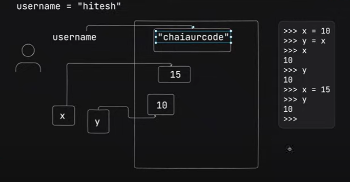

# Python Learning

## Mutable and Immutable data types 
  
  ## Mutable (jo change ho sakta hai )
  * list 
  * set 
  * dictionary
  * bytearray
  * array

  ## Immutable (jo change nahi hota balki dusri object ban jati hai )

  * integers 
  * floating - point numbers 
  * boolean 
  * strings 
  * frozen set 
  * bytes 
 
 ## Image reference to show the difference between mutable and immutable 

 strinf and number ke case me wo purana wala wahi reh jata hai aur naya wala value me reference update ho jata hai  
 baad me garbage collector aake ussko clean kar deta hai  

 </img>

 - keyError -> matlab dictionary iss naam ki koi key nahi hai

 # Internal working of python

 </img>